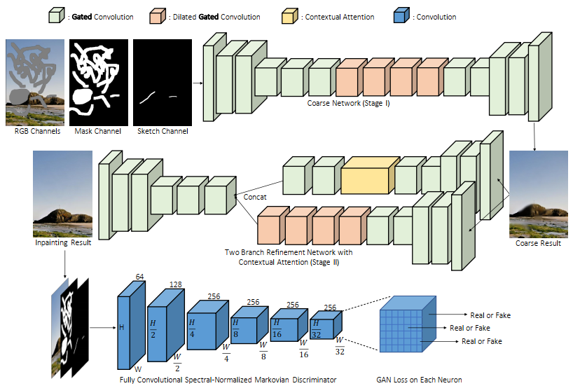

Tensorflow 2.x implementation of ["Free-Form Image Inpainting with Gated Convolution"](https://github.com/JiahuiYu/generative_inpainting). 
This repository does not include everything. For example it is missing user guidance. 

You don't need the Neural Gym library dependencies to run, so you can update much easier the code in native Tensorflow 2 eager execution. 

It also includes an alternative generator architecture with the name GeneratorMulticolumn(). It has the same coarse-fine structure as "Free-Form Image Inpainting with Gated Convolution", but with a multi-column coarse stage inspired by "Image Inpainting via Generative Multi-column Convolutional Neural Networks".

Dependencies

* Python 3

* Tensorflow 2.x

* Numpy 

* Matplotlib

* TQDM

* OpenCV

* Pandas

* PyYAML

* PIL
    
Directory Structure

- DeepFill-TF2

    - config.py

    - test_epoch.py

    - training.py

    - utils.py

    - sn.py

    - net.py

- training_checkpoints

- inpaint.yml

- TRAIN #Should contain training images 

- TEST  #Should contain inference/testing images

Just add the images of the dataset in the Train-Test folders and run  ``python3 DeepFill-TF2/training.py``.
